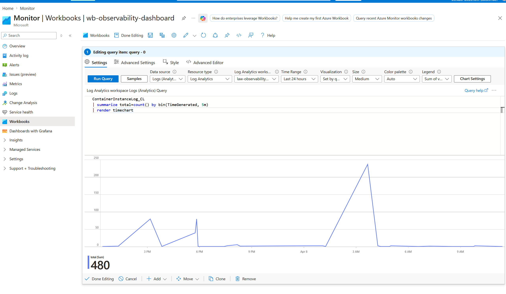
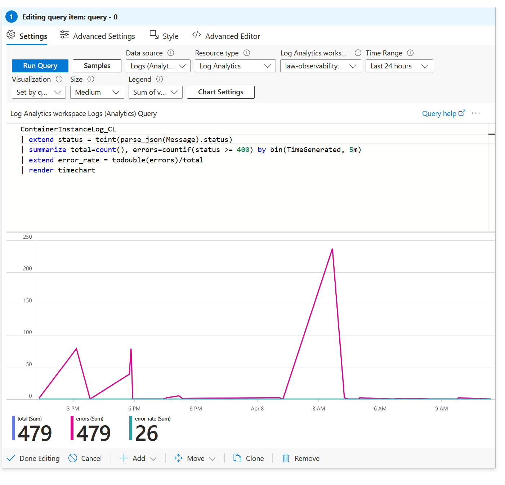
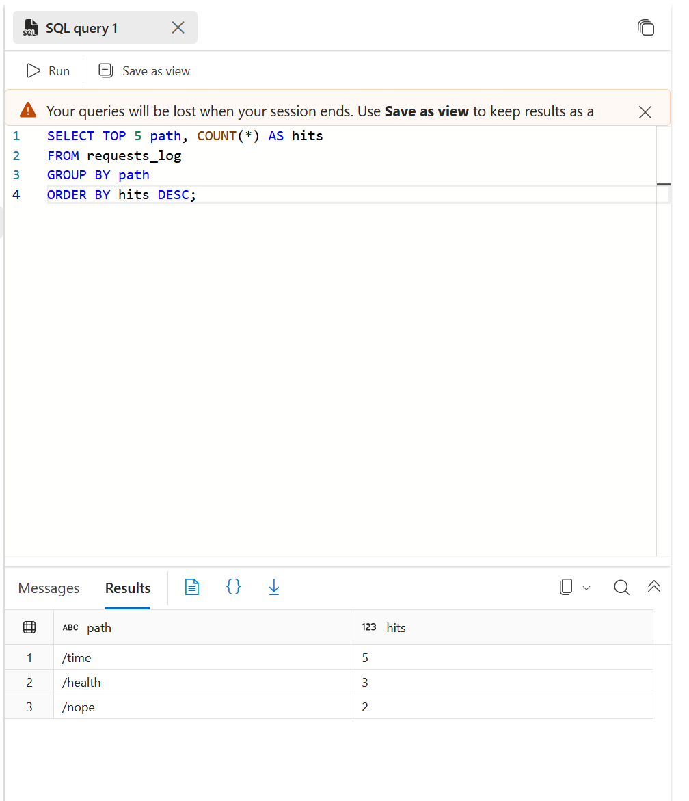
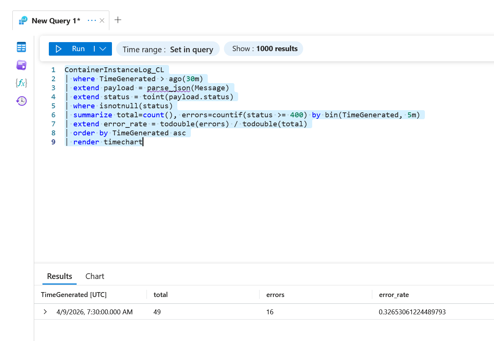
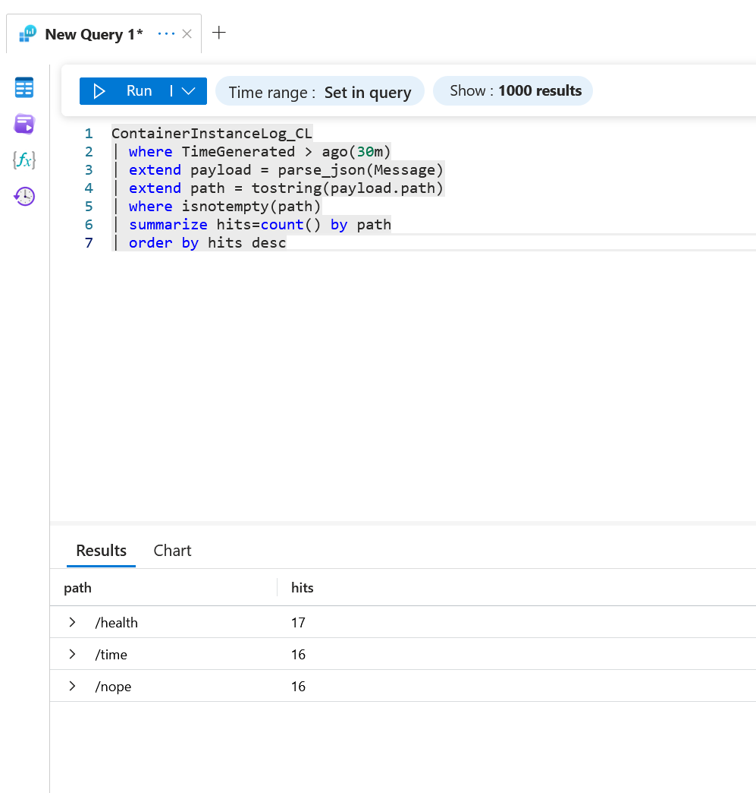
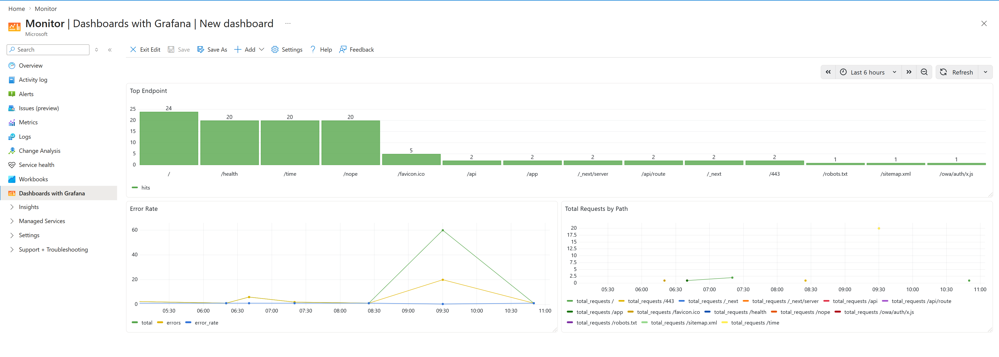

# 📘 LAB13 — Workbooks: Dashboard SLI e confronto SQL vs Log

---

## Che cosa faremo in questo lab

Costruiremo una **dashboard visuale** usando i **Workbooks** di Azure Monitor.

Fino a questo punto del corso avete:
- raccolto log applicativi dalla ACI (il vostro container)
- centralizzato i log in **Log Analytics**
- fatto query **KQL** per calcolare gli SLI
- fatto query **SQL** sulla tabella `requests_log`
- impostato un alert basato sull'error rate


---

## Prerequisiti

Prima di iniziare dovete aver completato:
- ✅ **LAB10** — avete la tabella `requests_log` nel database SQL
- ✅ **LAB11** — avete il Log Analytics Workspace con dati ingestiti
- ✅ La vostra **ACI** (Azure Container Instance) deve essere attiva e aver generato traffico

---

## Step 1 — Setup locale in WSL Ubuntu

Aprite il vostro terminale WSL Ubuntu e digitate:

```bash
mkdir -p ~/course/lab13 && cd ~/course/lab13
```

**Cosa fa:**
- `mkdir -p` → crea la cartella `lab13` dentro `~/course/`. L'opzione `-p` fa sì che non dia errore se la cartella esiste già, e crea anche le cartelle intermedie se mancano
- `&&` → esegue il secondo comando **solo se** il primo è andato a buon fine
- `cd` → entra nella cartella appena creata

Poi avviate la registrazione della sessione:

```bash
script -a cmdlog_lab13.txt
```

**Cosa fa:**
- `script` è un comando Linux che **registra tutto quello che fate nel terminale** in un file di testo
- `-a` → **append**, cioè aggiunge al file invece di sovrascriverlo
- `cmdlog_lab13.txt` → è il nome del file dove viene salvata la registrazione
- Da questo momento, ogni comando che scrivete e ogni output che vedete viene salvato automaticamente

Infine create la cartella per le evidenze:

```bash
mkdir -p docs
```

---

## Step 2 — Aprite Azure Monitor e create un Workbook

Andate nel **portale Azure** (https://portal.azure.com).

### Percorso nel portale:

1. Nella barra di ricerca in alto, scrivete **Monitor** e cliccate sul servizio "Monitor"
2. Nel menu a sinistra, cliccate su **Workbooks**
3. Cliccate su **+ Create** (o **+ Nuovo**)

Vi chiederà di selezionare un workspace. Selezionate il vostro Log Analytics Workspace:

```
law-observability
```

> ⚠️ **Attenzione:** Il nome del vostro workspace potrebbe essere diverso. Usate quello che avete creato nei lab precedenti. Nel mio caso era `law-observability-francia`.

Salvate il workbook con il nome:

```
wb-observability-dashboard
```

Per salvarlo: cliccate sull'icona **💾 Save** nella barra in alto, inserite il nome e confermate.

### ✅ Checkpoint #1
Il workbook deve risultare **creato e salvato**. Fate uno screenshot.

Ecco come appariva il mio dopo averlo configurato:



---

## Step 3 — Sezione A: Total Requests

Dentro il workbook, dovete aggiungere la prima query.

### Come aggiungere una query al Workbook:

1. Cliccate su **+ Add** nella barra in basso
2. Selezionate **Add query**
3. Si apre un editor. Nella sezione "Data source" selezionate **Logs (Analytics)**
4. In "Resource type" selezionate **Log Analytics**
5. In "Log Analytics workspace" selezionate il vostro workspace
6. Nell'area della query, incollate:

```kql
ContainerInstanceLog_CL
| summarize total=count() by bin(TimeGenerated, 5m)
| render timechart
```

Poi cliccate il bottone blu **Run Query**.

### Spiegazione della query riga per riga:

```kql
ContainerInstanceLog_CL
```
→ Legge la tabella `ContainerInstanceLog_CL`. Questa è la tabella custom dove Azure salva i log del vostro container ACI. Il suffisso `_CL` sta per "Custom Log".

```kql
| summarize total=count() by bin(TimeGenerated, 5m)
```
→ Il **pipe** `|` passa i dati al prossimo operatore.
- `summarize` → aggrega i dati (come un `GROUP BY` in SQL)
- `total=count()` → conta il numero di righe e mette il risultato in una colonna chiamata `total`
- `by bin(TimeGenerated, 5m)` → raggruppa per intervalli di 5 minuti. `bin()` è come un "secchio": prende tutti gli eventi che cadono nello stesso intervallo di 5 minuti e li mette insieme. `TimeGenerated` è il timestamp di quando è arrivato l'evento.

```kql
| render timechart
```
→ Dice a Log Analytics di **renderizzare** il risultato come un **grafico temporale** (linea nel tempo).

### Cosa dovreste vedere

Un grafico con una linea che mostra il volume di richieste nel tempo. Se avete generato traffico con gli script dei lab precedenti, vedrete dei picchi.

### Impostazioni di visualizzazione

Nella barra delle impostazioni sopra la query:
- **Time Range**: `Last 24 hours` (o il periodo che copre il vostro traffico)
- **Visualization**: dovrebbe essere impostato automaticamente da `render timechart`, ma se non vedete il grafico, cambiatelo manualmente a **Set by query** o **Time chart**
- **Size**: Medium

📸 **Fate uno screenshot** della sezione Total Requests.

---

## Step 4 — Sezione B: Error Rate

Aggiungete un'altra query al workbook:
1. Cliccate su **+ Add** → **Add query**
2. Configurate di nuovo il data source come prima (Logs Analytics, il vostro workspace)
3. Incollate questa query:

```kql
ContainerInstanceLog_CL
| extend status = toint(parse_json(Message).status)
| summarize total=count(), errors=countif(status >= 400) by bin(TimeGenerated, 5m)
| extend error_rate = todouble(errors)/total
| render timechart
```

> [!WARNING]
> **ATTENZIONE — Possibile adattamento necessario:**
> La traccia originale usa `LogEntry_s` come campo, ma nel vostro ambiente il campo potrebbe chiamarsi `Message`. Se la query non restituisce risultati con `LogEntry_s`, sostituitelo con `Message`. Nel mio caso ho dovuto usare `Message`.

### Spiegazione riga per riga:

```kql
ContainerInstanceLog_CL
```
→ Come prima, legge la tabella dei log del container.

```kql
| extend status = toint(parse_json(Message).status)
```
→ Qui facciamo due cose:
- `extend` → aggiunge una **nuova colonna** al risultato (non modifica i dati, solo aggiunge)
- `parse_json(Message)` → il campo `Message` contiene una stringa JSON tipo `{"path": "/health", "status": 200, "duration_ms": 0}`. `parse_json()` la trasforma da testo a un oggetto strutturato, così possiamo accedere ai singoli campi
- `.status` → prende il campo `status` dall'oggetto JSON
- `toint()` → converte il valore in un numero intero (perché ci serve confrontare con `>= 400`)

```kql
| summarize total=count(), errors=countif(status >= 400) by bin(TimeGenerated, 5m)
```
→ Aggrega per intervalli di 5 minuti e calcola:
- `total=count()` → conta tutte le richieste
- `errors=countif(status >= 400)` → conta solo le richieste con status code 400 o superiore (errori HTTP: 400 Bad Request, 404 Not Found, 500 Internal Server Error, ecc.)

```kql
| extend error_rate = todouble(errors)/total
```
→ Aggiunge una colonna `error_rate`:
- `todouble()` → converte `errors` in un numero decimale (altrimenti la divisione tra interi darebbe 0 o 1)
- `errors/total` → la percentuale di errori sul totale

```kql
| render timechart
```
→ Mostra il risultato come grafico temporale.

### Cosa dovreste vedere

Un grafico con tre linee: `total`, `errors`, e `error_rate`. Se avete generato traffico verso endpoint inesistenti (tipo `/nope`), vedrete che la linea degli errori segue quella del totale.



Nel mio caso si vede che `total = 479`, `errors = 479` — praticamente tutto il traffico generato dallo script LAB12 erano chiamate a `/nope` (404).

📸 **Fate uno screenshot** della sezione Error Rate.

---

## Step 5 — Sezione C: Top Endpoint

Aggiungete la terza e ultima query:
1. **+ Add** → **Add query**
2. Configurate il data source
3. Incollate:

```kql
ContainerInstanceLog_CL
| extend path = tostring(parse_json(Message).path)
| summarize hits=count() by path
| order by hits desc
```

> Anche qui, se la traccia dice `LogEntry_s`, usate `Message` se nel vostro ambiente il campo si chiama così.

### Spiegazione riga per riga:

```kql
ContainerInstanceLog_CL
```
→ Legge la tabella dei log.

```kql
| extend path = tostring(parse_json(Message).path)
```
→ Come prima, parsa il JSON e prende il campo `path` (es. `/health`, `/time`, `/nope`). `tostring()` lo converte in stringa.

```kql
| summarize hits=count() by path
```
→ Conta quante volte ogni endpoint è stato chiamato. `by path` raggruppa per endpoint.

```kql
| order by hits desc
```
→ Ordina i risultati dal più chiamato al meno chiamato (`desc` = discendente).

### Cosa dovreste vedere

Una **tabella** (non un grafico, perché non c'è `render timechart`) che elenca tutti gli endpoint con il numero di hit.


Nel mio caso `/nope` domina con 200 hit. Notate anche le richieste a `/.env`, `/.git/config` — sono **scan automatici di bot** che tentano di trovare file sensibili. Questo è un esempio reale di come l'observability rivela anche attività inattese!

### ✅ Checkpoint #2
Il workbook deve contenere **3 visualizzazioni funzionanti**.

📸 **Fate uno screenshot** della sezione Top Endpoint.

---

## Step 6 — Salvate il workbook

Cliccate sull'icona **💾 Save** nella barra in alto per salvare definitivamente il workbook.

Verificate che il nome sia:
```
wb-observability-dashboard
```

---

## Step 7 — Confronto con SQL: aprite il database

Ora viene la parte del confronto. Dovete andare nel **database SQL** che avete creato nel LAB10.

### Percorso nel portale:

1. Nella barra di ricerca, scrivete **SQL databases**
2. Aprite il vostro database (nel mio caso si chiama `obsdb`)
3. Nel menu a sinistra, cliccate su **Query editor (preview)**
4. Fate il login con le credenziali del database (quelle che avete impostato nel LAB10)

---

## Step 8 — Eseguite la query SQL di confronto

Nel Query Editor, incollate e eseguite:

```sql
SELECT TOP 5 path, COUNT(*) AS hits
FROM requests_log
GROUP BY path
ORDER BY hits DESC;
```

### Spiegazione riga per riga:

```sql
SELECT TOP 5 path, COUNT(*) AS hits
```
→ Seleziona le prime 5 righe. Per ogni `path` (endpoint), conta quante righe ci sono (`COUNT(*)`) e chiama il risultato `hits`.

```sql
FROM requests_log
```
→ Legge dalla tabella `requests_log` — quella che avete creato e popolato manualmente nel LAB10.

```sql
GROUP BY path
```
→ Raggruppa per endpoint (come il `summarize ... by` di KQL).

```sql
ORDER BY hits DESC;
```
→ Ordina dal più frequente al meno frequente.

### Cosa dovreste vedere



Un risultato molto più piccolo rispetto a Log Analytics. Nel mio caso:

| path | hits |
|------|------|
| /time | 5 |
| /health | 3 |
| /nope | 2 |

📸 **Fate uno screenshot** del risultato SQL.

---

## Step 9 — Confronto ragionato: perché i numeri sono diversi?

Questa è la parte più importante del lab dal punto di vista concettuale. Dovete scrivere nel vostro report **perché i numeri tra SQL e Log Analytics sono diversi**.

### La risposta breve:

> La tabella SQL `requests_log` contiene solo i **record inseriti manualmente** nel LAB10 (nel mio caso 10 record). Log Analytics invece raccoglie **tutta la telemetria reale** del container in modo continuo: ogni richiesta HTTP che arriva al container viene loggata automaticamente.

### Motivi di divergenza (da scrivere nel report):

1. **Dataset diversi** — SQL contiene dati inseriti a mano, Log Analytics raccoglie tutto il traffico runtime
2. **Finestra temporale** — la query SQL non ha un filtro temporale, la query KQL legge "Last 24 hours"
3. **Latenza di ingestione** — i log possono impiegare qualche minuto ad arrivare in Log Analytics
4. **Eventi non persistiti** — non tutte le richieste vengono scritte in SQL (dipende dal codice dell'app)

> [!IMPORTANT]
> **Concetto chiave da ricordare:** La differenza tra le fonti dati **non è un errore**. È una conseguenza del diverso meccanismo di raccolta. In observability, ogni fonte racconta un aspetto diverso della stessa storia.

---

## Step 10 — Create il file delle evidenze

Create il file `docs/evidence_lab13.md` con tutte le informazioni raccolte. Usate la struttura che trovate nella traccia del lab. Inserite:
- screenshot dei 3 pannelli del workbook
- la query SQL e il suo output
- il confronto ragionato (3-6 righe)
- le vostre note finali

---

## ✅ Criteri di completamento LAB13

Il lab è completato se:
- [x] Workbook creato e salvato come `wb-observability-dashboard`
- [x] 3 visualizzazioni funzionanti (Total Requests, Error Rate, Top Endpoint)
- [x] Confronto SQL vs Log Analytics documentato
- [x] File evidenze completo

---
---

# 📙 LAB13bis — Dashboarding avanzato: KQL, Workbooks e Grafana

---

## Che cosa faremo in questo lab

Questo lab **estende** il LAB13. Faremo tre cose nuove:

1. **Workbook avanzato** — non più 3 sezioni ma **5**, con query KQL più sofisticate
2. **Dashboard Grafana** — costruiremo una dashboard con un altro strumento (Grafana) usando gli stessi dati
3. **Confronto ragionato** — Workbook vs Grafana: quando usare l'uno e quando l'altro

### Le 5 query che costruiremo:

| Query | Cosa mostra | Tipo di domanda |
|-------|-------------|-----------------|
| A. Total Requests by Path | Volume traffico per endpoint nel tempo | "Quanto traffico arriva e dove?" |
| B. Error Rate | % di errori nel tempo | "Il servizio sta fallendo?" |
| C. Status Distribution | Distribuzione dei codici di stato | "Qual è il peso di ogni tipo di risposta?" |
| D. Latenza P95 | Tempo di risposta medio e percentile 95 | "Quanto è lento il servizio?" |
| E. Top Endpoint | Endpoint più usati | "Dove si concentra il traffico?" |

### Workbook vs Grafana — la differenza in breve:

- **Workbook** = ottimo per **analisi e documentazione**. Sta dentro il portale Azure, permette di mescolare testo e query, perfetto per troubleshooting e post-mortem
- **Grafana** = ottimo per **monitoraggio continuo**. Dashboard compatte, visuali, da mettere su uno schermo e controllare in tempo reale (stile NOC — Network Operations Center)

---

## Prerequisiti

- ✅ **LAB13 completato**
- ✅ ACI attiva
- ✅ Log Analytics Workspace con dati recenti
- ✅ Accesso al portale Azure

---

## Step 1 — Setup locale in WSL Ubuntu

```bash
mkdir -p ~/course/lab13bis && cd ~/course/lab13bis
```

→ Crea la cartella del lab ed entra dentro.

```bash
script -a cmdlog_lab13bis.txt
```

→ Inizia a registrare la sessione.

```bash
mkdir -p docs
```

→ Crea la cartella per le evidenze.

---

## Step 2 — Verifica il contesto Azure

```bash
az account show --output table
```

### Spiegazione:
- `az account show` → mostra i dettagli della subscription Azure attualmente attiva
- `--output table` → formatta l'output come tabella leggibile

Dovete vedere la vostra subscription. Se non siete autenticati, fate prima `az login`.

📸 Copiate l'output nel file evidenze.

---

## Step 3 — Impostate le variabili

```bash
export RG="rg-observability-lab"
export LAW_NAME="law-observability"
export ACI_NAME="obsapp-aci"
```

### Spiegazione:
- `export` → crea una **variabile d'ambiente** visibile a tutti i comandi nella sessione
- `RG` → il nome del vostro Resource Group
- `LAW_NAME` → il nome del vostro Log Analytics Workspace
- `ACI_NAME` → il nome della vostra Azure Container Instance

> ⚠️ **Adattate i nomi ai valori reali del vostro ambiente!** I nomi sopra sono di esempio.

Verificate:

```bash
echo "$RG"
echo "$LAW_NAME"
echo "$ACI_NAME"
```

→ `echo` stampa il valore della variabile. Se vedete i nomi corretti, siete a posto.

---

## Step 4 — Generate traffico controllato

Prima dobbiamo avere dei dati freschi nelle dashboard. Generiamo traffico verso la nostra app.

### Recuperate l'IP pubblico della ACI:

```bash
ACI_PUBLIC_IP=$(az container show \
  --resource-group "$RG" \
  --name "$ACI_NAME" \
  --query ipAddress.ip -o tsv)

echo "$ACI_PUBLIC_IP"
```

### Spiegazione riga per riga:

```bash
ACI_PUBLIC_IP=$(...)
```
→ La sintassi `$(...)` esegue il comando tra parentesi e salva il risultato nella variabile `ACI_PUBLIC_IP`.

```bash
az container show \
  --resource-group "$RG" \
  --name "$ACI_NAME" \
```
→ Interroga Azure per ottenere i dettagli del container. I `\` a fine riga servono per spezzare un comando lungo su più righe.

```bash
  --query ipAddress.ip -o tsv
```
→ `--query ipAddress.ip` usa **JMESPath** (un linguaggio di query per JSON) per estrarre solo il campo dell'IP. `-o tsv` → output come testo semplice (senza virgolette o formattazione JSON).

### Generate il traffico:

```bash
for i in {1..20}; do
  curl -s "http://$ACI_PUBLIC_IP:8000/health" > /dev/null
  curl -s "http://$ACI_PUBLIC_IP:8000/time" > /dev/null
  curl -s "http://$ACI_PUBLIC_IP:8000/nope" > /dev/null
  sleep 1
done
```

### Spiegazione riga per riga:

```bash
for i in {1..20}; do
```
→ Un ciclo `for` che si ripete **20 volte**. `{1..20}` genera i numeri da 1 a 20. `do` indica l'inizio del corpo del ciclo.

```bash
  curl -s "http://$ACI_PUBLIC_IP:8000/health" > /dev/null
```
→ `curl` fa una richiesta HTTP GET all'endpoint `/health`.
- `-s` → **silent**, non mostra la barra di progresso
- `> /dev/null` → butta via l'output (non ci interessa la risposta, solo che la richiesta venga fatta)
- `/health` → endpoint che risponde 200 (successo)

```bash
  curl -s "http://$ACI_PUBLIC_IP:8000/time" > /dev/null
```
→ Richiesta a `/time` — anche questo risponde 200.

```bash
  curl -s "http://$ACI_PUBLIC_IP:8000/nope" > /dev/null
```
→ Richiesta a `/nope` — questo endpoint **non esiste**, quindi risponde **404** (errore). Questo ci serve per avere errori nelle dashboard!

```bash
  sleep 1
```
→ Aspetta 1 secondo tra un ciclo e l'altro, così i dati si distribuiscono nel tempo.

```bash
done
```
→ Fine del ciclo.

**Risultato:** 20 cicli × 3 richieste = **60 richieste totali** (40 successo + 20 errori).

📸 Annotate l'orario in cui avete generato il traffico (vi servirà per impostare il time range delle query).

> [!WARNING]
> **Aspettate 3-5 minuti** prima di procedere — i log impiegano un po' ad arrivare in Log Analytics.

---

## Step 5 — Verificate il dataset in Log Analytics

### Percorso nel portale:

1. Cercate il vostro workspace (es. `law-observability`)
2. Nel menu a sinistra, cliccate su **Logs**
3. Se vi si apre una finestra con query di esempio, chiudetela (cliccate la X)

### Eseguite la query di verifica:

```kql
ContainerInstanceLog_CL
| project TimeGenerated, Message
| take 20
```

### Spiegazione:

```kql
ContainerInstanceLog_CL
```
→ Legge la tabella dei log del container.

```kql
| project TimeGenerated, Message
```
→ `project` seleziona solo le colonne che ci interessano (come `SELECT` in SQL). Prendiamo il timestamp e il messaggio.

```kql
| take 20
```
→ Prende solo le prime 20 righe (come `LIMIT 20` in SQL o `TOP 20` in SQL Server).

### Cosa dovreste vedere:


Nella colonna `Message` dovreste vedere stringhe JSON tipo:

```json
{"request_id": "d6c05d8d-...", "path": "/health", "status": 200, "duration_ms": 0}
```

Se vedete dati → siete pronti. Se la tabella è vuota, aspettate qualche minuto e riprovate.

---

## Step 6 — Costruite e validate le 5 query KQL

Ora andiamo a costruire le 5 query che useremo sia nel Workbook che in Grafana. **Testate prima ogni query in Log Analytics** (sezione Logs del workspace) per assicurarvi che funzioni, e solo dopo la inserite nel Workbook.

---

### Query A — Total Requests nel tempo per endpoint

```kql
ContainerInstanceLog_CL
| where TimeGenerated > ago(30m)
| extend payload = parse_json(Message)
| extend path = tostring(payload.path)
| where isnotempty(path)
| summarize total_requests=count() by bin(TimeGenerated, 5m), path
| order by TimeGenerated asc
| render timechart
```

### Spiegazione riga per riga:

```kql
| where TimeGenerated > ago(30m)
```
→ `where` filtra le righe (come `WHERE` in SQL). `ago(30m)` significa "30 minuti fa". Prendiamo solo i log degli ultimi 30 minuti.

> ⚠️ **Se sono passati più di 30 minuti** dalla generazione del traffico, cambiate `30m` con un valore più grande, tipo `2h` (2 ore) o `24h` (24 ore).

```kql
| extend payload = parse_json(Message)
```
→ Parsa il JSON del campo `Message` e lo salva in una variabile `payload`. Questo è un trucco per semplificare le righe successive.

```kql
| extend path = tostring(payload.path)
```
→ Estrae il campo `path` dal JSON e lo converte in stringa.

```kql
| where isnotempty(path)
```
→ Filtra via le righe dove `path` è vuoto o null. Questo succede per i log che non sono richieste HTTP (es. messaggi di startup del container).

```kql
| summarize total_requests=count() by bin(TimeGenerated, 5m), path
```
→ Conta le richieste raggruppando per **intervallo di 5 minuti** e per **endpoint**. A differenza del LAB13, qui disaggreghiamo per path — così vediamo quale endpoint genera più carico.

```kql
| order by TimeGenerated asc
```
→ Ordina cronologicamente (`asc` = ascendente, dal più vecchio al più recente).

```kql
| render timechart
```
→ Grafico temporale.


---

### Query B — Error Rate nel tempo

```kql
ContainerInstanceLog_CL
| where TimeGenerated > ago(30m)
| extend payload = parse_json(Message)
| extend status = toint(payload.status)
| where isnotnull(status)
| summarize total=count(), errors=countif(status >= 400) by bin(TimeGenerated, 5m)
| extend error_rate = todouble(errors) / todouble(total)
| order by TimeGenerated asc
| render timechart
```

### Cosa c'è di diverso dal LAB13:

- `where TimeGenerated > ago(30m)` → aggiunto filtro temporale
- `where isnotnull(status)` → filtra le righe senza status code
- `todouble(errors) / todouble(total)` → entrambi convertiti in double per sicurezza



---

### Query C — Distribuzione degli status code

```kql
ContainerInstanceLog_CL
| where TimeGenerated > ago(30m)
| extend payload = parse_json(Message)
| extend status = tostring(payload.status)
| where isnotempty(status)
| summarize hits=count() by status
| order by hits desc
```

### Spiegazione della differenza:

Questa query **non ha** `render timechart` → restituisce una **tabella**. Non ci interessa il trend nel tempo, ma la **distribuzione complessiva**: quanti 200, quanti 404, quanti 500, ecc.

- `tostring(payload.status)` → convertiamo in stringa perché qui lo usiamo come categoria, non come numero


> [!TIP]
> **Per la presentazione:** "Questa vista mostra il peso relativo dei vari status code. A differenza del timechart, qui vediamo la distribuzione complessiva."

---

### Query D — Latenza media e P95 per endpoint

```kql
ContainerInstanceLog_CL
| where TimeGenerated > ago(30m)
| extend payload = parse_json(Message)
| extend path = tostring(payload.path), latency_ms = todouble(payload.latency_ms)
| where isnotempty(path) and isnotnull(latency_ms)
| summarize avg_latency_ms=avg(latency_ms), p95_latency_ms=percentile(latency_ms, 95) by path
| order by p95_latency_ms desc
```

> [!WARNING]
> **Possibile adattamento:** Nel mio ambiente il campo si chiama `duration_ms` anziché `latency_ms`. Controllate il JSON dei vostri log (Step 5) per vedere come si chiama il campo del tempo di risposta nel vostro caso.

### Spiegazione dei concetti nuovi:

```kql
| extend path = tostring(payload.path), latency_ms = todouble(payload.latency_ms)
```
→ Si possono estrarre **più campi** nella stessa riga `extend`, separati da virgola.

```kql
| summarize avg_latency_ms=avg(latency_ms), p95_latency_ms=percentile(latency_ms, 95) by path
```
→ Due metriche di latenza per ogni endpoint:
- `avg()` → **media aritmetica** del tempo di risposta
- `percentile(latency_ms, 95)` → il **percentile 95** (P95). Significa: il 95% delle richieste ha risposto in meno di questo tempo. È molto più utile della media perché cattura i casi "lenti" che la media nasconde.

**Esempio pratico:** Se 99 richieste rispondono in 1ms e 1 richiesta risponde in 5 secondi:
- Media = ~51ms (sembra ok)
- P95 = ~1ms (ancora ok)
- P99 = 5000ms (rivela il problema!)


**Nota sui miei risultati:** Nel mio caso la latenza era quasi sempre 0ms perché nel codice `app.py` ho usato `int()` per convertire i millisecondi, che tronca i decimali. Il picco di 4ms su `/health` è dovuto al **cold start** (la prima richiesta impiega più tempo perché il container deve "svegliarsi").

---

### Query E — Top Endpoint

```kql
ContainerInstanceLog_CL
| where TimeGenerated > ago(30m)
| extend payload = parse_json(Message)
| extend path = tostring(payload.path)
| where isnotempty(path)
| summarize hits=count() by path
| order by hits desc
```

Questa è simile alla versione del LAB13, con in più il filtro temporale e il parsing tramite `payload`.



---

## Step 7 — Create il Workbook avanzato

### Percorso nel portale:

1. Andate in **Monitor** → **Workbooks**
2. Create un nuovo workbook (o duplicate quello del LAB13)
3. Salvatelo con nome:

```
wb-observability-advanced
```

### Aggiungete le 5 sezioni:

Per ogni sezione fate: **+ Add** → **Add query** → configurate il data source → incollate la query → **Run Query**.

| # | Sezione | Query | Visualizzazione consigliata |
|---|---------|-------|---------------------------|
| 1 | Total Requests per endpoint | Query A | Timechart (impostato da `render timechart`) |
| 2 | Error Rate | Query B | Timechart |
| 3 | Distribuzione status code | Query C | **Pie chart** (o Bar chart) — cambiatelo nel dropdown "Visualization" |
| 4 | Latenza P95 | Query D | **Table** (tabella) |
| 5 | Top Endpoint | Query E | **Bar chart** (o Table) |

> [!TIP]
> Per cambiare il tipo di visualizzazione: nella barra delle impostazioni della query, cercate il dropdown **"Visualization"** e selezionate il tipo desiderato (Set by query, Bar chart, Pie chart, Table, ecc.).

> [!TIP]
> Potete aggiungere del **testo descrittivo** al workbook: **+ Add** → **Add text**. Scrivete un titolo o una descrizione per ogni sezione.

### ✅ Checkpoint #1
Il workbook avanzato deve essere salvato e contenere **5 sezioni funzionanti**.


📸 **Fate screenshot** del workbook completo.

---

## Step 8 — Accedete a Grafana nel portale Azure

### Percorso nel portale:

1. Cercate **Monitor** nella barra di ricerca
2. Nel menu a sinistra, cliccate su **Dashboards with Grafana**

> [!NOTE]
> Questo è il percorso "Dashboards with Grafana" che usa Grafana **integrato** nel portale Azure. Non crea una nuova risorsa, non costa nulla di aggiuntivo. È il percorso obbligatorio del lab.

Si aprirà un'interfaccia Grafana direttamente nel portale.

---

## Step 9 — Create una nuova dashboard Grafana

1. Cliccate su **New** (o il + in alto)
2. Selezionate **New dashboard**
3. Cliccate su **Add visualization**
4. Vi chiede di scegliere un data source → selezionate **Azure Monitor**

---

## Step 10 — Pannello 1: Total Requests

Dentro l'editor del pannello Grafana:

1. In basso, nella sezione della query, selezionate **Service** = **Logs**
2. Selezionate il vostro **workspace** dal dropdown
3. Incollate la query KQL (**senza** `| render timechart` — Grafana gestisce la visualizzazione da solo):

```kql
ContainerInstanceLog_CL
| where TimeGenerated > ago(30m)
| extend payload = parse_json(Message)
| extend path = tostring(payload.path)
| where isnotempty(path)
| summarize total_requests=count() by bin(TimeGenerated, 5m), path
| order by TimeGenerated asc
```

> ⚠️ **In Grafana NON mettete `| render timechart`** — è Grafana che decide come visualizzare, non KQL.

4. In alto a destra, nel dropdown della **visualizzazione**, selezionate **Time series**
5. Come **titolo del pannello** scrivete: `Total Requests by Path`
6. Cliccate **Apply** per salvare il pannello

---

## Step 11 — Pannello 2: Error Rate

1. Cliccate **+ Add** → **Add visualization** → **Azure Monitor**
2. Service = **Logs**, selezionate il workspace
3. Query:

```kql
ContainerInstanceLog_CL
| where TimeGenerated > ago(30m)
| extend payload = parse_json(Message)
| extend status = toint(payload.status)
| where isnotnull(status)
| summarize total=count(), errors=countif(status >= 400) by bin(TimeGenerated, 5m)
| extend error_rate = todouble(errors) / todouble(total)
| order by TimeGenerated asc
```

4. Visualizzazione: **Time series**
5. Titolo: `Error Rate`
6. **Apply**

---

## Step 12 — Pannello 3: Top Endpoint

1. **+ Add** → **Add visualization** → **Azure Monitor**
2. Service = **Logs**, workspace
3. Query:

```kql
ContainerInstanceLog_CL
| where TimeGenerated > ago(30m)
| extend payload = parse_json(Message)
| extend path = tostring(payload.path)
| where isnotempty(path)
| summarize hits=count() by path
| order by hits desc
```

4. Visualizzazione: **Bar chart** (oppure Table)
5. Titolo: `Top Endpoint`
6. **Apply**

---

## Step 13 — Salvate la dashboard Grafana

1. Cliccate **Save** (o **Save As**) nella barra in alto
2. Nome della dashboard:

```
grafana-observability-overview
```

3. Confermate

### ✅ Checkpoint #2
La dashboard deve contenere **3 pannelli funzionanti**.



> [!NOTE]
> Nel mio caso ho usato `24h` come time range perché era passato più di mezz'ora dalla generazione del traffico. Potete cambiare il time range dal selettore in alto a destra nella dashboard Grafana (es. "Last 6 hours").

📸 **Fate screenshot** della dashboard completa.

---

## Step 14 — Confronto Workbook vs Grafana

Ora avete **due dashboard** costruite dagli stessi dati. Dovete scrivere un confronto ragionato di **8-12 righe**.

### Domande guida:

1. **Velocità di costruzione** — dove avete costruito più rapidamente?
2. **Facilità di interpretazione** — dove è più facile leggere il dato?
3. **KQL** — dove vi è sembrato più naturale usarlo?
4. **Layout** — quale strumento è più orientato al monitoraggio continuo?
5. **Caso d'uso** — quando usereste Workbook e quando Grafana?

### Esempio di risposta (la mia):

> I Workbooks permettono un uso di KQL più rapido e naturale: l'ambiente è nativo e permette di affiancare query, testo e risultati in modo fluido. Sono perfetti per analisi esplorativa o documentazione di troubleshooting. Grafana richiede qualche passaggio in più per configurare i pannelli, ma restituisce un layout visivo nettamente superiore, compatto e orientato al monitoraggio continuo.
>
> **In sintesi:** Workbooks per runbook, post-mortem e analisi. Grafana per dashboard operative live (stile NOC).

---

## Step 15 — Relazione con il confronto SQL del LAB13

Aggiungete un terzo punto di vista al confronto del LAB13.

Ora avete tre "attori":

| Strumento | Ruolo |
|-----------|-------|
| **SQL Database** | Persistenza strutturata dei dati |
| **Log Analytics (KQL)** | Motore di query veloce su log centralizzati |
| **Grafana** | Strato di visualizzazione/presentazione |

**Concetto chiave da scrivere nel report:**

> Grafana **non crea nuovi dati**. Interroga le stesse sorgenti (Azure Monitor / Log Analytics) ma li presenta in un formato ottimizzato per il monitoraggio continuo. Grafana ci fa passare dalla "ricerca attiva" del dato (scrivo una query) all'"osservazione passiva" (guardo uno schermo e vedo subito se c'è un problema).

---

## Step 16 — Estensione facoltativa: Azure Managed Grafana

> ⚠️ Fate questa parte **solo se avete tempo** e il docente è d'accordo. Crea una nuova risorsa Azure.

### 16.1 — Registrate il provider e l'estensione CLI:

```bash
az provider register -n Microsoft.Dashboard --wait
```
→ Registra il provider Azure per le risorse Dashboard. `--wait` aspetta che la registrazione sia completa.

```bash
az extension add --name amg
```
→ Aggiunge l'estensione `amg` (Azure Managed Grafana) alla CLI di Azure.

### 16.2 — Create il workspace Managed Grafana:

```bash
export GRAFANA_NAME="amgobs$(date +%m%d%H%M%S)"
```
→ Genera un nome unico per il workspace usando la data corrente. `$(date +%m%d%H%M%S)` produce una stringa tipo `0409112217` (mese-giorno-ora-minuto-secondo).

```bash
az grafana create \
  --name "$GRAFANA_NAME" \
  --resource-group "$RG"
```
→ Crea la risorsa Azure Managed Grafana. Questo può richiedere **qualche minuto**.

### 16.3 — Recuperate l'endpoint:

```bash
az grafana show \
  --name "$GRAFANA_NAME" \
  --resource-group "$RG" \
  --query "properties.endpoint" -o tsv
```
→ Restituisce l'URL della vostra istanza Grafana. Apritelo nel browser.

### 16.4 — Verificate il data source:

Dentro Managed Grafana:
1. Andate in **Connections** → **Data sources**
2. Verificate che **Azure Monitor** sia presente
3. Se necessario, configurate l'autenticazione tramite **Managed Identity**
4. Fate **Save & test** per verificare la connessione

### 16.5 — Cleanup (quando avete finito):

```bash
az grafana delete \
  --name "$GRAFANA_NAME" \
  --resource-group "$RG" \
  --yes
```
→ Elimina la risorsa. Fatelo per non avere costi inutili!

---

## Step 17 — Create il file evidenze

Create `docs/evidence_lab13bis.md` con:
- contesto Azure (RG, workspace, ACI)
- traffico generato (comando + orario)
- le 5 query con screenshot
- screenshot del workbook avanzato
- screenshot della dashboard Grafana
- confronto Workbook vs Grafana (8-12 righe)
- relazione con il confronto SQL (6-10 righe)
- estensione Managed Grafana (se eseguita)
- note finali

---

## Step 18 — Commit e push

```bash
git add docs/evidence_lab13bis.md
git commit -m "[LAB13bis] Dashboarding avanzato e Grafana completato"
git push
```

---

## ✅ Criteri di completamento LAB13bis

- [x] Le 5 query KQL sono state eseguite e comprese
- [x] Workbook avanzato creato (`wb-observability-advanced`) con 5 sezioni
- [x] Dashboard Grafana creata (`grafana-observability-overview`) con 3 pannelli
- [x] Confronto Workbook vs Grafana documentato
- [x] File evidenze completo

---

# 🧠 Concetti chiave da ricordare

| # | Concetto | Spiegazione breve |
|---|----------|------------------|
| 1 | Una dashboard non è un ornamento | È uno strumento operativo per leggere rapidamente lo stato del sistema |
| 2 | KQL è il motore, la dashboard è il mezzo | Se la query è debole, anche la dashboard sarà debole |
| 3 | `parse_json()` | Converte una stringa JSON in un oggetto strutturato su cui puoi usare `.field` |
| 4 | `bin(TimeGenerated, 5m)` | Raggruppa gli eventi in "secchi" temporali di 5 minuti |
| 5 | `countif(condition)` | Conta solo le righe che soddisfano la condizione |
| 6 | `percentile(field, 95)` | Il valore sotto il quale cade il 95% dei dati — cattura i casi anomali |
| 7 | `extend` vs `project` | `extend` aggiunge colonne, `project` seleziona colonne (e rimuove le altre) |
| 8 | Workbook vs Grafana | Workbook = analisi/documentazione. Grafana = monitoraggio live |
| 9 | Grafana non crea dati | È solo uno strato di visualizzazione sopra le stesse sorgenti |
| 10 | Fonti diverse = numeri diversi | Non è un errore, è una caratteristica dell'architettura osservabile |
