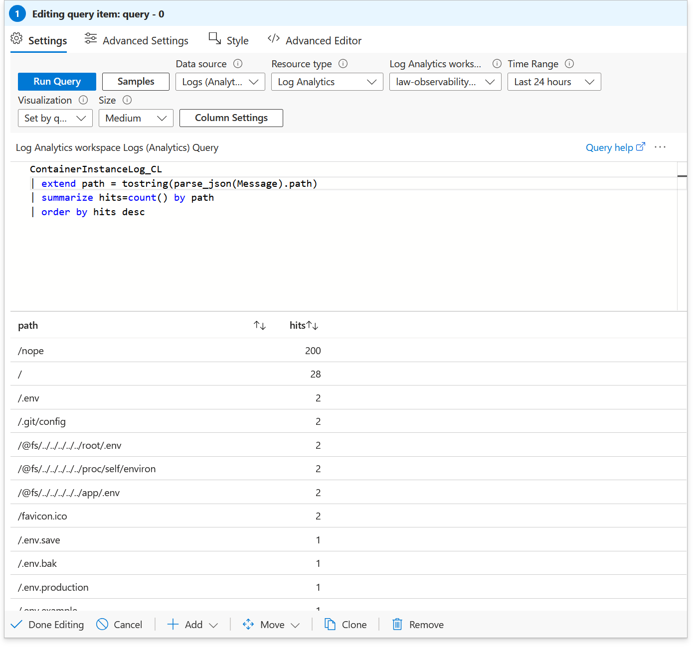

# LAB13 - Evidence

## 1. Workbook
- Nome workbook: wb-observability-dashboard
- Workspace usato: law-observability-francia

## 2. Sezione A - Total Requests
- Query usata:
```kql
ContainerInstanceLog_CL
| summarize total=count() by bin(TimeGenerated, 5m)
| render timechart
```


* Screenshot allegato: SÌ
* Osservazioni:Il grafico mostra l'andamento del traffico nel tempo, evidenziando picchi significativi (uno dei quali supera le 200 richieste in un singolo bucket da 5 minuti). Il contatore totale riporta quasi 500 richieste complessive registrate nei log.

## 3. Sezione B - Error Rate

* Query usata:

```kql
ContainerInstanceLog_CL
| extend status = toint(parse_json(Message).status)   
| summarize total=count(), errors=countif(status >= 400) by bin(TimeGenerated, 5m)
| extend error_rate = todouble(errors)/total
| render timechart
```
 (*Usato Message al posto di LogEntry_s)

 

* Screenshot allegato: SÌ
* Osservazioni:Il grafico evidenzia che nei momenti di picco di traffico si è registrata un'altissima concentrazione di errori. La linea degli errori segue in modo quasi sovrapponibile quella delle richieste totali, dimostrando che l'impennata di traffico era costituita in gran parte da chiamate fallite (coerente con lo script di generazione errori del LAB12).

## 4. Sezione C - Top Endpoint

* Query usata:

```kql
ContainerInstanceLog_CL
| extend path = tostring(parse_json(Message).path)  
| summarize hits=count() by path
| order by hits desc
```
 (*Usato Message al posto di LogEntry_s)

* Screenshot allegato: SÌ
* Osservazioni:L'endpoint nettamente più chiamato è /nope con 200 hit, a conferma delle iterazioni del comando curl lanciate nello step di simulazione dell'alert.

## 5. Confronto SQL

### Query SQL

```sql
SELECT TOP 5 path, COUNT(*) AS hits
FROM requests_log
GROUP BY path
ORDER BY hits DESC;
```

### Output

[incollare output o descrivere risultato]

## 6. Confronto ragionato

Perché i numeri potrebbero differire tra SQL e Log Analytics?

[risposta in 3-6 righe]

I numeri sono differenti perché la tabella SQL requests_log contiene unicamente il dataset statico di 10 record inseriti manualmente a scopo didattico nel LAB10. Al contrario, Log Analytics raccoglie in modo continuo la telemetria reale del container: include quindi tutte le richieste automatizzate generate dallo script del LAB12 (le 200 chiamate a /nope). In sintesi, SQL riflette una persistenza manuale/puntuale, mentre i log mostrano l'intero traffico runtime.


## 7. Note finali

* Che cosa ho capito sui Workbooks:Permettono di trasformare query sparse in dashboard interattive e "vive", aggregando volume, qualità ed endpoint

* Che cosa ho capito sul confronto tra fonti dati:Che non bisogna mai fidarsi di un solo numero senza capirne il contesto di ingestione. Database e log centralizzati catturano la realtà con granularità, tempistiche e filtri completamente differenti.

* Quale visualizzazione considero più utile e perché:L'Error Rate è la metrica operativamente più utile, perché non si limita a dire quanto il servizio sta lavorando, ma rivela immediatamente se sta fallendo, che è il primo campanello d'allarme per chi fa observability ed SRE.
