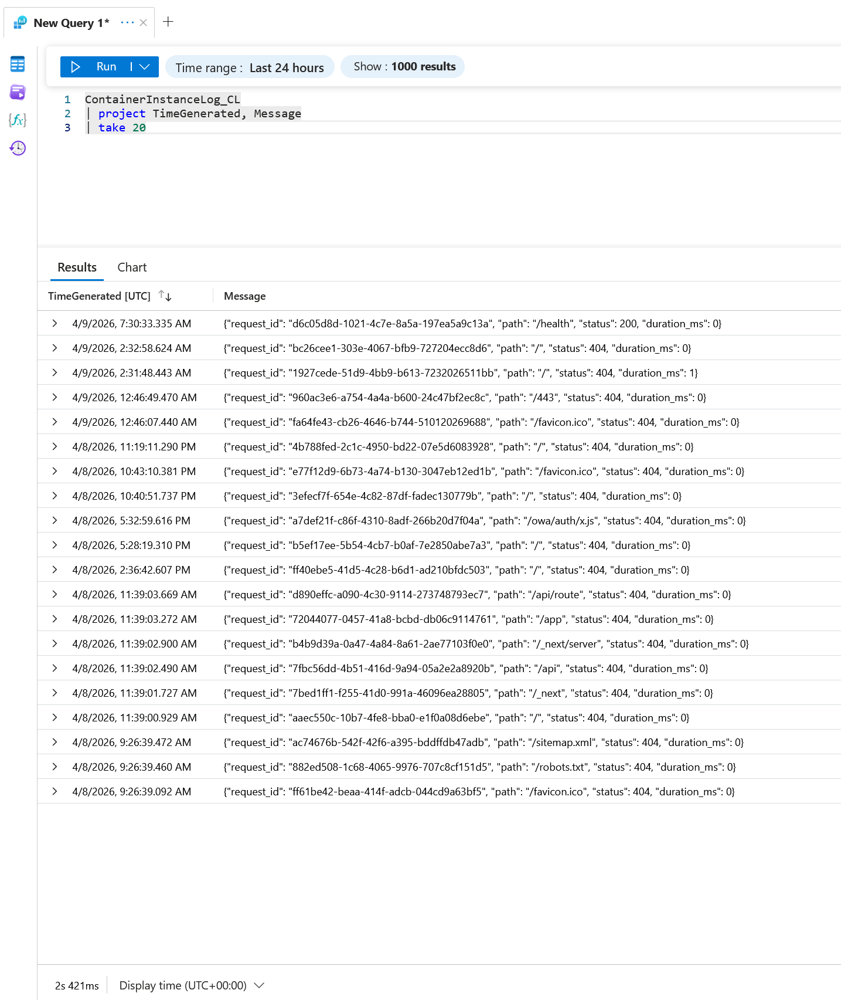
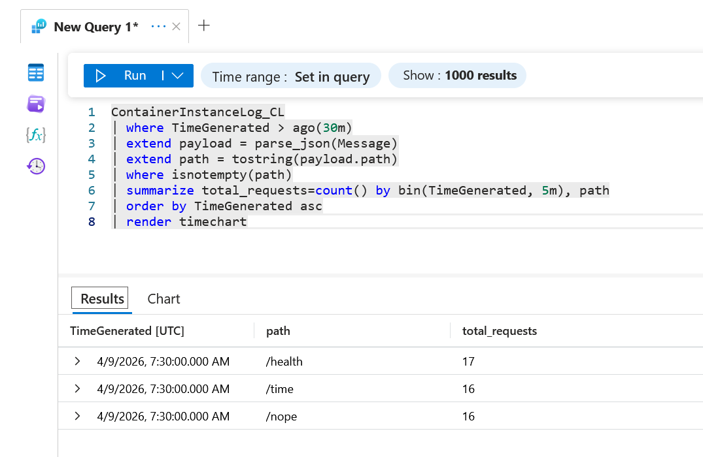
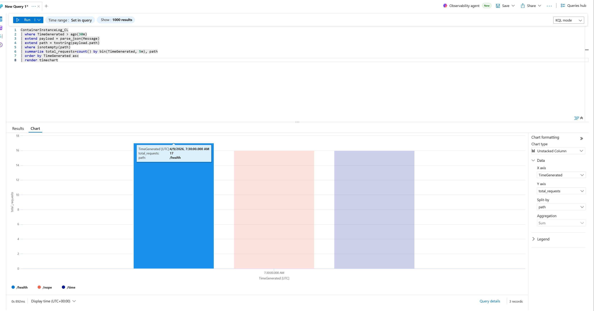
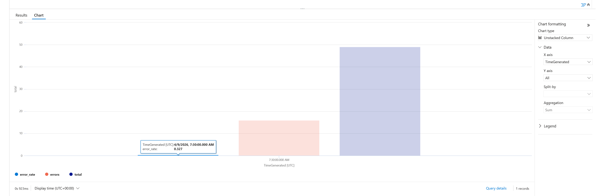
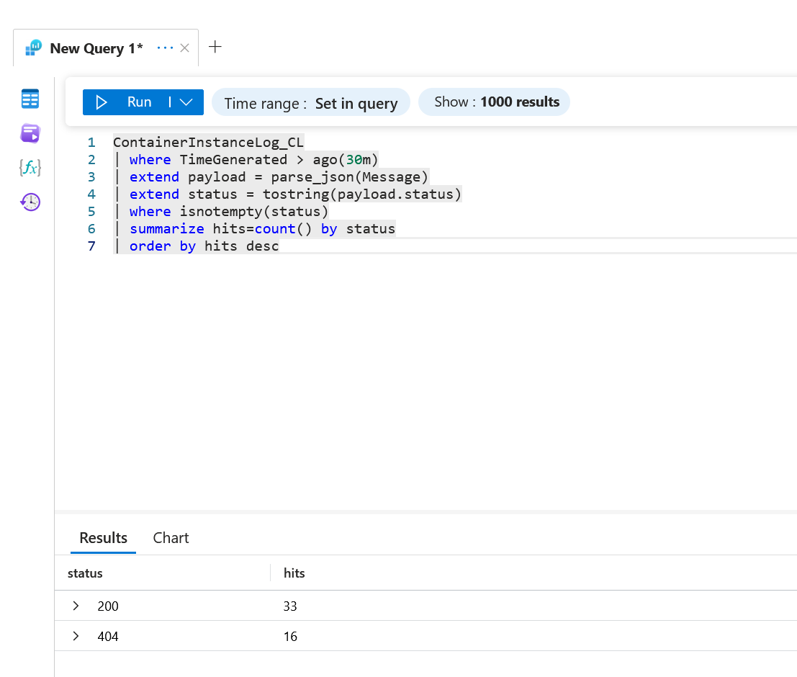
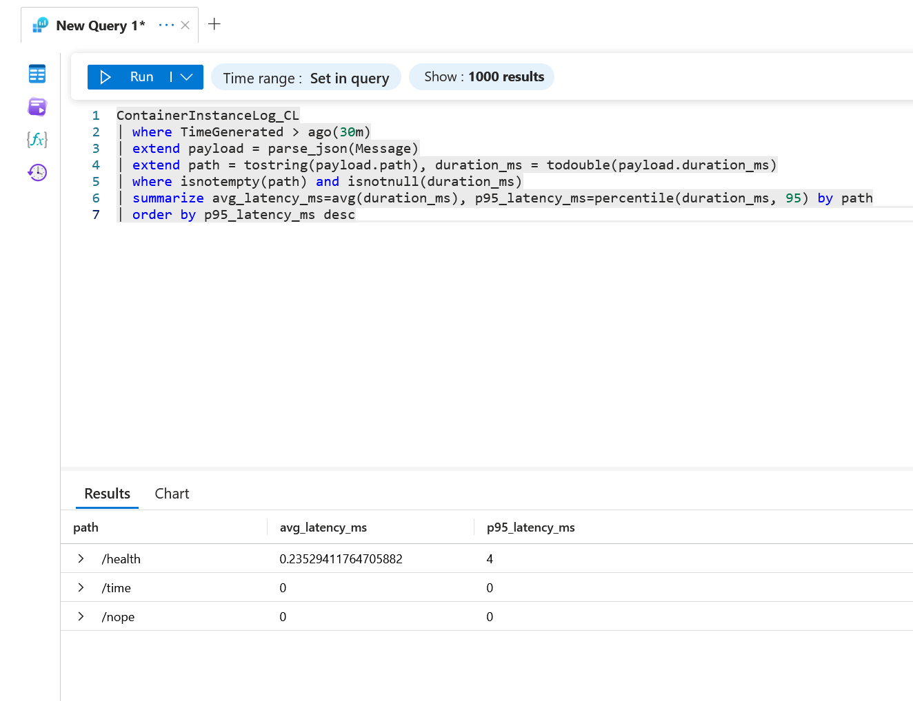
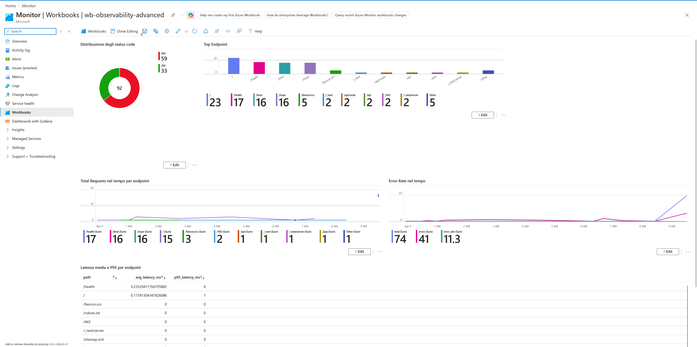

# LAB13bis - Evidence

## 1. Contesto Azure
- Resource Group:  rg-observability-lab
- Log Analytics Workspace:   law-observability-francia
- ACI:  obsapp-aci
- Dashboard Grafana usata: Dashboards with Grafana / Azure Managed Grafana

## 2. Traffico generato
- Comando usato:  for i in {1..20}; do
  curl -s "http://$ACI_PUBLIC_IP:8000/health" > /dev/null
  curl -s "http://$ACI_PUBLIC_IP:8000/time" > /dev/null
  curl -s "http://$ACI_PUBLIC_IP:8000/nope" > /dev/null
  sleep 1
done
- Orario approssimativo:  09:31

## 3. Query KQL validate

### Query 0 - Verifica Dataset

message:{"request_id": "d6c05d8d-1021-4c7e-8a5a-197ea5a9c13a", "path": "/health", "status": 200, "duration_ms": 0}
### Query A - Total Requests by Path
[incollare query]
ContainerInstanceLog_CL
| where TimeGenerated > ago(30m)
| extend payload = parse_json(Message)
| extend path = tostring(payload.path)
| where isnotempty(path)
| summarize total_requests=count() by bin(TimeGenerated, 5m), path
| order by TimeGenerated asc
| render timechart

### Query B - Error Rate
[incollare query]
ContainerInstanceLog_CL
| where TimeGenerated > ago(30m)
| extend payload = parse_json(Message)
| extend status = toint(payload.status)
| where isnotnull(status)
| summarize total=count(), errors=countif(status >= 400) by bin(TimeGenerated, 5m)
| extend error_rate = todouble(errors) / todouble(total)
| order by TimeGenerated asc
| render timechart

### Query C - Status Distribution
[incollare query]

ContainerInstanceLog_CL
| where TimeGenerated > ago(30m)
| extend payload = parse_json(Message)
| extend status = tostring(payload.status)
| where isnotempty(status)
| summarize hits=count() by status
| order by hits desc

### Query D - Avg + P95 Latency
[incollare query]
ContainerInstanceLog_CL
| where TimeGenerated > ago(30m)
| extend payload = parse_json(Message)
| extend path = tostring(payload.path), duration_ms = todouble(payload.duration_ms)     
| where isnotempty(path) and isnotnull(duration_ms)
| summarize avg_latency_ms=avg(duration_ms), p95_latency_ms=percentile(duration_ms, 95) by path
| order by p95_latency_ms desc

(ho usato duration_ms al posto di latency_ms perche la mia app.py è diversa.)

1. Perché i tempi risultano a zero?
È colpa di un dettaglio nel codice che ho scritto in app.py. Per calcolare il tempo ci mette la richiesta, ho usato:  int((time.time() - g.start) * 1000). La funzione int() tronca i decimali. Se una richiesta ci mette ad esempio 0.8 millisecondi, il codice taglia i decimali e registra brutalmente "0"

2. Perché c'è quel picco di 4 millisecondi su /health?
Questo effetto si chiama "partenza a freddo" (o Cold Start) : la primissima volta che interroghiamo l'applicazione, lei deve "svegliarsi" e caricare le sue cose, quindi  inizialmente ci mette del tempo di più. Una volta che si è scaldata i tempi scendono di nuovo a zero
### Query E - Top Endpoint
[incollare query]
ContainerInstanceLog_CL
| where TimeGenerated > ago(30m)
| extend payload = parse_json(Message)
| extend path = tostring(payload.path)
| where isnotempty(path)
| summarize hits=count() by path
| order by hits desc

## 4. Workbook avanzato
- Nome workbook: wb-observability-advanced
- Numero sezioni:  5
- Screenshot allegati: SÌ
- Osservazioni: ho dovuto cambiare l ora delle query siccome mezz ora è passata dal traffico che avevo generato

## 5. Dashboard Grafana
- Nome dashboard: grafana-observability-overview
- Numero pannelli:3
- Screenshot allegati: SÌ
- Osservazioni: anche in questo caso nella query invece di 30m (minuti) ho scritto 24h

## 6. Confronto Workbook vs Grafana

Confrontando i due strumenti, ho trovato che i Workbooks permettono un uso di KQL molto più rapido e naturale: l'ambiente è nativo e permette di affiancare query, testo e risultati in modo fluido, rendendoli perfetti per l'analisi esplorativa o la documentazione di troubleshooting. Grafana, al contrario, richiede qualche passaggio in più per configurare i pannelli, ma restituisce un layout visivo nettamente superiore, compatto e orientato al monitoraggio continuo. In Grafana l'interpretazione del dato a colpo d'occhio (es. picchi o anomalie) è molto più immediata. In sintesi: userei i Workbooks per creare "runbook" interattivi, post-mortem o per esplorare log, mentre sceglierei Grafana senza dubbio per le dashboard operative live (stile NOC) da tenere sempre visibili su uno schermo per controllare la salute del sistema in tempo reale.

## 7. Relazione con il confronto SQL del LAB13

Aggiungendo Grafana al confronto tra database SQL e Log Analytics, emerge un concetto chiave: Grafana non crea né storicizza alcun dato nuovo, ma ne migliora la fruizione. Mentre SQL garantisce l'integrità strutturale e Log Analytics (con KQL) offre un motore velocissimo per estrarre e aggregare enormi volumi di log, Grafana si pone puramente come "strato di presentazione". Grafana cambia il nostro approccio operativo: passiamo dalla "ricerca attiva" del dato (scrivere una query per leggere una tabella) all'"osservazione passiva" (guardare un timechart per individuare visivamente un trend o un'anomalia). La bontà del dato dipende sempre da Log Analytics e da come scrivo la query KQL, ma Grafana trasforma quel dato da un semplice record di log a una metrica operativa immediatamente azionabile.

## 8. Estensione Managed Grafana (facoltativa)
- Eseguita: SÌ
- Nome workspace Managed Grafana:
- Endpoint:  https://amgobs0409112217-deh6cnb4cvbfgjc2.weu.grafana.azure.com
- Problemi riscontrati: nessuno
- Soluzione adottata: -

## 9. Note finali

- **Che cosa ho capito sul rapporto tra query e visualizzazione:** Ho capito che scrivere una query sintatticamente corretta è solo metà del lavoro. La vera observability richiede che la scelta della visualizzazione sia coerente con la domanda operativa che mi sto ponendo. Se uso una tabella al posto di un timechart per cercare un picco di traffico, rischio di nascondere l'informazione. KQL estrae il dato, ma è la visualizzazione a renderlo piu comprensibile.
- **Quale strumento considero più utile per analisi tecnica:** Considero più utili i **Workbooks**. Essendo integrati nativamente in Azure, sono perfetti per esplorare i log in modo esplorativo, "sporcandosi le mani" con KQL e unendo appunti testuali ai risultati delle query. Sono l'ideale per documentare un'analisi post-mortem o scrivere un runbook interattivo per il team.
- **Quale strumento considero più utile per monitoraggio operativo:** Senza dubbio **Grafana**. La flessibilità del layout e l'ottimizzazione degli spazi lo rendono perfetto per costruire dashboard da lasciare a schermo intero (stile NOC). Permette di capire a colpo d'occhio la salute del sistema, mettendo in risalto trend e anomalie in tempo reale molto meglio di quanto faccia un Workbook.
